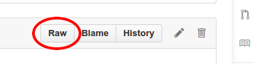

name: inverse
layout: true
class: center, middle, inverse

---

# A little example
### Lecture 1
## Course name

.right-column[.footnote[Data Science Seville]]

---

layout: false

# A huge title, for example

And because it's `Markdown`, you can write it like this:

```markdown
# A huge title, for example
```

So, use the [Markdown cheat sheet](https://github.com/adam-p/markdown-here/wiki/Markdown-Cheatsheet) and the [Remark documentation](https://github.com/gnab/remark/wiki) for write open and homogeneus slides. And of course, take a look to the [source](https://github.com/DataScienceSeville/course-template/blob/master/Lecture%201:%20A%20little%20example/slides.md) `Markdown` of these slides and of the courses's lectures.

### Important:
Please, remember that these slides should be used like **study material**, so make them as slides for **lectures**.

---

# Images

Put the images for your slides in a `images` folder at the same level of this same file. For use them:

```markdown
.center[]
```
And you will get this:

.center[]

---

# .left[`$$\LaTeX{}$$`]

With [MathJax](http://www.mathjax.org/) you can use LaTeX expressions in almost every web page. With [Remark](https://github.com/gnab/remark) the inline mode doesn't work very well. That's the reason that the title of this slide is centered. Let's see how to use the other kind of layout, the displayed one. With this little piece of syntax:

```markdown
`$$
\begin{aligned}
\dot{x} & = \sigma(y-x) \\
\dot{y} & = \rho x - y - xz \\
\dot{z} & = -\beta z + xy
\end{aligned}
$$`
```

You will get this expresion:

`$$
\begin{aligned}
\dot{x} & = \sigma(y-x) \\
\dot{y} & = \rho x - y - xz \\
\dot{z} & = -\beta z + xy
\end{aligned}
$$`

Awesome!

---

# Slides viewer

For viewing your slides offline or while you are writting them, just download the `index.html` file from the [Slides viewer](https://github.com/DataScienceSeville/slides-viewer) repository to the slides's directory and open it with with **Firefox**, Chrome don't work for the offline mode.

For using the tool for slides in the repositories, as an online viewer, just copy the URL you get when you click the `Raw` button in the GitHub's slides.md page.

.center[]

Delete any extra parameter the URL could have, like the `token` one and you will get something like this:

```markdown
https://raw.githubusercontent.com/DataScienceSeville/course-template/master/Lecture%201:%20A%20little%20example/slides.md
```

After that, paste it after this other URL:

```markdown
http://datascienceseville.github.io/slides-viewer/viewer.html?md=
```

That way you can have a link like this [one](http://datascienceseville.github.io/slides-viewer/viewer.html?md=https://raw.githubusercontent.com/DataScienceSeville/course-template/master/Lecture%201:%20A%20little%20example/slides.md).
